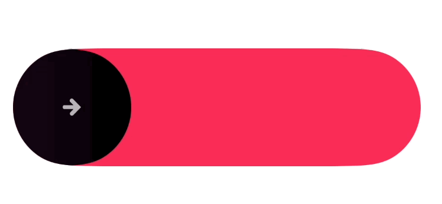
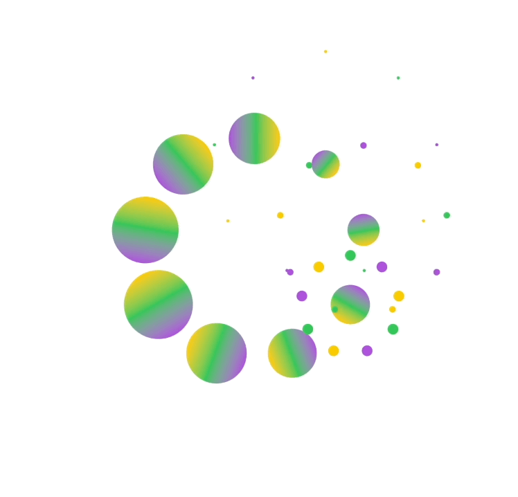
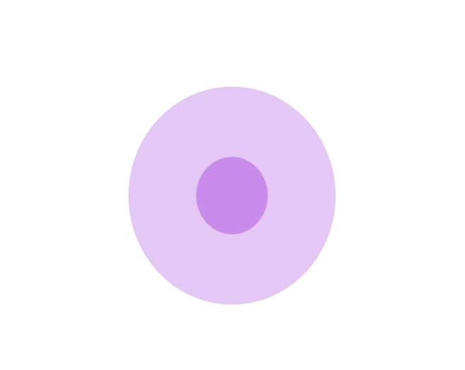
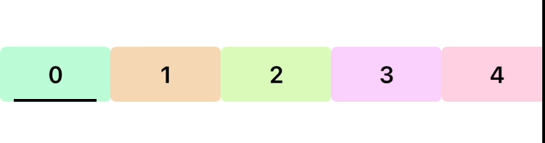
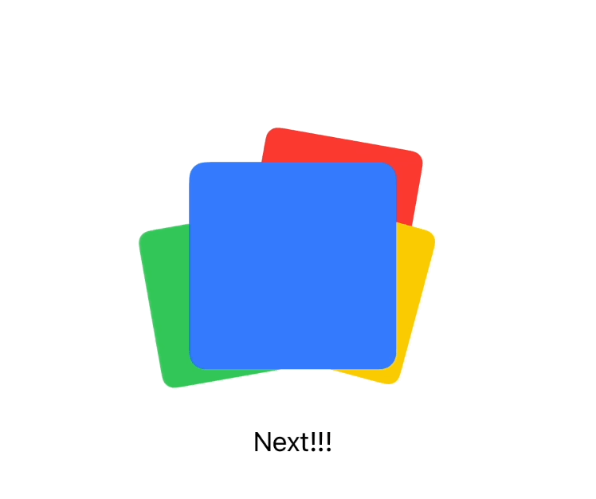

# SwiftUI-Animation

All the animations are implemented 100% by SwiftUI

## [SlideButton](./swiftui-animation/components/SlideButton.swift)

## [FireworkLoading](./swiftui-animation/components/FireworkLoading.swift)

## [Radar](./swiftui-animation/components/Radar.swift)

## [DynamicGradientText](./swiftui-animation/components/DynamicGradientText.swift)

## [ThemeSelectBar](./swiftui-animation/components/ThemeSelectBar.swift)

## [CascadingCard](./swiftui-animation/components/CascadingCard.swift)

## [DripEffectView](./swiftui-animation/components/DripEffectView.swift)

## [GPTAnimatedText](./swiftui-animation/components/GPTAnimatedText.swift)

